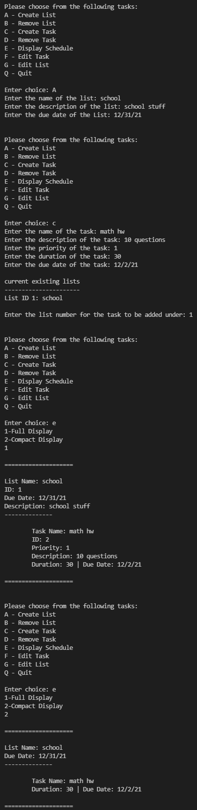
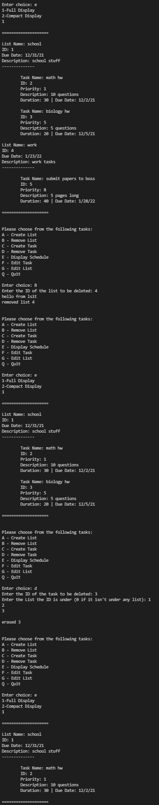
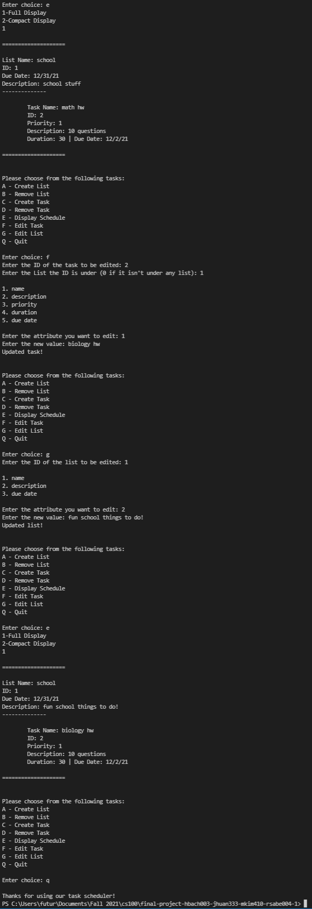

 > As you complete each section you **must** remove the prompt text. Every *turnin* of this project includes points for formatting of this README so keep it clean and keep it up to date. 
 > Prompt text is any lines beginning with "\>"
 > Replace anything between \<...\> with your project specifics and remove angle brackets. For example, you need to name your project and replace the header right below this line with that title (no angle brackets). 
# Task Scheduler 
 Authors: [Jingwen Huang](https://github.com/JingwenHuang233),
 [Minsoo Kim](https://github.com/minsooerickim),
 [Rania Saber](https://github.com/rsabe004),
 [Hannah Bach](https://github.com/hbach24)

## Project Description
As college students, it is crucial to stay organized and stay on top of school work. Accordingly, we decided to develop our task scheduler to allow students to have all of their tasks stored in an organized fashion that is also very easy to access and modify. Using our scheduler will not only help with academic performance but also save a ton of time. We believe that our task scheduler can help students just like us.

The tools we used to build this project include
* [C++](https://www.cplusplus.com/) - programming language created by Bjarne Stroustrup.
* [Valgrind](https://valgrind.org/) - programming tool for memory leak detection.
* [CMake](https://cmake.org/) - software for build automation, testing, packaging and installation.

The following is the list of inputs and outpus of our task scheduler
* Inputs
    * Title of task
    * Task’s description 
    * Importance of task (priority)
    * Task duration 
    * Task deadline
* Outputs
    * Full Display (displays all the information regarding task/list)
    * Compact Display (displays only the crucial information regarding the task/list)
* Features
    * Ability to delete tasks  
    * Ability to edit tasks 
    * Display tasks
    * Can add subtasks under a main task 
    * Users can create a list with multiple tasks

## Class Diagram

We decided to use the composite and strategy pattern to develop our task scheduler. Our task scheduler consists of tasks and lists. We used a composite pattern to have both tasks and lists use the same interface, Scheduler. List serves as the composite and task serves as the leaf class. This way, the lists could have other lists and tasks as its children. Using the composite pattern made the client interaction much simpler and adding additional components is very straight forward. In our Scheduler interface, we also made sure to include the Display pointer, which brings us to the strategy pattern we used. We implemented the Display feature in out program using the strategy pattern. The pointer in our Scheduler class will decide for us which algorithm in our abstract Display class to use. Using the strategy pattern allowed us to have families of related algorithms and to vary the algorithm independelntly from the context. Without the strategy pattern, we would have had to use numerous conditional statements and would break the SOLID principle with the addition of a new algorithm.
 
## Screenshots
* 
* ```A```
    * When ```A``` option is chosen, the user is prompted to enter values for the list name, description, and due date. Upon entering, the scheduler automatically generates a list with the provided information
* ```C```
    * When ```C``` option is chosen, the user is prompted to enter values for the task name, description, priority, duration, and the due date. Then, the program asks which list the task should be inserted under. The program then automatically generates a task with the provided inputs and inserts it under the provided list number.
* ```E```
    * When ```E``` option is chosen, the user is prompted to choose between a ```Full Display``` and a ```Compact Display```. ```Full Display``` displays the name, id, due date, and description for lists; Name, id, poriority, description, duration, and due date for tasks. On the other hand ```Compact Display``` displays just the name and due date for lists; Name, duration, and due date for tasks.
* 
* ```B```
    * When ```B``` option is chosen, the user is prompted to enter the ID of the list to be deleted. The program then automatically deletes the list and all of its contents.
* ```D```
    * When ```D``` option is chosen, the user is prompted to enter the ID of the task to be deleted along with the List ID it is under. The program then deletes the selected task.
* 
* ```F```
    * When ```F``` option is chosen, the user is prompted to enter the ID of the task to be edited and the list it is under. The program then displays the properties of the task that can be modified. The user then enters the attribute number they desire to edit along with its new value. The program takes the new value and automatically updates the task with the new value.
* ```G```
    * When ```G``` option is chosen, the user is prompted to enter the ID of the list. The program then displays the properties of the list that can be modified. The user then enters the attribute number they desire to edit along with its new value. The program takes the new value and automatically updates the task with the new value.
* ```Q```
    * When ```Q``` option is chosen, the program simply quits

## Installation/Usage
1. Recursively clone this repository onto your local machine with ```git clone --recursive <https://github.com/cs100/final-project-hbach003-jhuan333-mkim410-rsabe004-1.git>```
2. Change directory into the local repository you just created using ```cd```
3. Once inside the local repository, run ```cmake3 .```
4. run ```make```
5. run ```./scheduler``` 
6. You should be now prompted with the main menu. (The specifics of how to navigate through the menu is explained with the screenshots above)

## Testing
Unit Testing/CI

In order to test our project, we created unit tests for task and list functions using Google Test (gtest). These unit tests were made to ensure that the functions work in the correct manner. 


Memory Check/Free Memory

To view and fix memory leaks, we used Valgrind. Display pointer of Scheduler class is freed in the Scheduler destructor. The children vector of List class is freed in the list destructor by using a for loop to loop through all the children Scheduler pointers in the vector. We also delete the schedule pointer used to build the task scheduler at the end of the main.cpp.
